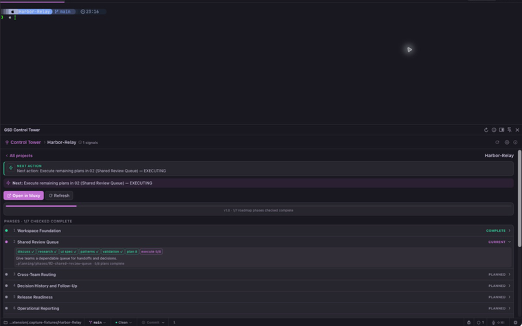
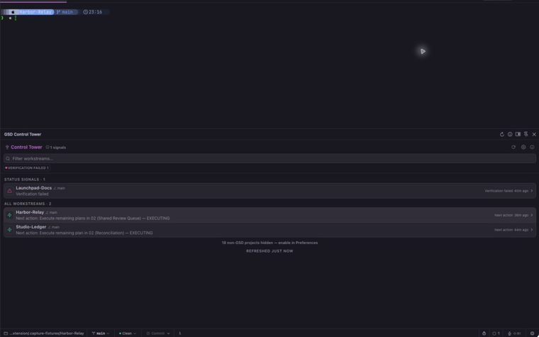

# GSD Control Tower for Muxy

> See what every GSD workstream is doing, which agent needs you, and where to go next — without leaving Muxy.

GSD Control Tower brings [GSD](https://github.com/open-gsd/gsd-core) project progress, next steps, and agent activity into one [Muxy](https://muxy.app/docs/extensions/overview) panel. It opens on your current project and gives you a cross-project view when you need it.

Planning status comes from each project's `.planning/` files. Agent status is available for sessions running inside Muxy.



## What it tells you

- Milestone progress, the current phase, and the next recorded action.
- A phase-by-phase view of the GSD artifacts each project actually uses.
- Factual signals for waiting agents, failed verification, unavailable planning data, and stale structured work.
- Agent activity reported by Muxy for each worktree.
- Branch, recent commit, and working-tree context.

## How status signals work

The **Status signals** list contains workstreams with one or more explicit signals. Rows sort by project and worktree name, and every applicable signal remains visible.



| State | Meaning |
| --- | --- |
| Waiting for you | An agent session in Muxy reports that it is waiting |
| Verification failed | The current phase has a failed verification result |
| Planning unavailable | Required GSD planning data could not be read |
| Stale | Open work has not changed within your chosen threshold |
| Next action | Structured GSD artifacts provide a next action and no agent is active |
| Working | An agent session in Muxy is working |
| No signal | None of the defined status signals is present |

Raw GSD status text is shown in project details but never affects a signal. Waiting and Working come from Muxy agent events. Verification failure comes from a typed verification result. Completion and open work come from phase checklists and counts. Paused comes from handoff fields, Stale uses dated activity, and Next action requires a value derived from structured artifacts.

Discussion, research, UI, patterns, review, security, and validation artifacts are optional. Control Tower shows only the artifacts a phase actually contains; a missing optional artifact is never treated as incomplete work.

## Permissions & privacy

The extension reads GSD planning files and Git status. It does not execute commands, change project files or Git state, read terminal output, send notifications, or make network requests.

Preferences and recent diagnostics are stored in Muxy's extension storage. Diagnostics may include relative planning paths and error messages, but not planning-file contents, terminal output, transcripts, or credentials.

| Permission | Why |
| --- | --- |
| `projects:read` / `worktrees:read` | List the projects and worktrees you already added to Muxy |
| `agents:read` | Show agent activity reported by Muxy |
| `files:read` | Read GSD files under `.planning/` |
| `git:read` | Show branch, recent commit, and changed-file count |
| `storage:read/write` | Remember your preferences and recent diagnostics |
| `panels:write` | Open the panel and update its status-bar item |
| `projects:write` + `worktrees:write` | Open a selected project or worktree in Muxy |

## Limitations

- Planning status is read from each project's active worktree. Other worktrees still show agent and Git activity.
- Changes outside the current project refresh while the panel is open. The interval is configurable in Preferences (5 minutes by default; Manual, 1, 5, 15, or 30 minutes).
- Agent sessions running outside Muxy are not shown.
- After restarting Muxy, open Control Tower once to refresh the status-bar count.
- Remote workspaces are not supported in 0.1.0.

## Requirements

- [Muxy](https://muxy.app/) on macOS. Version 0.1.0 was tested with Muxy 1.5.0 (945).
- Projects tracked with [GSD](https://github.com/open-gsd/gsd-core) — i.e. a `.planning/` directory. Non-GSD projects are hidden by default and can be shown in Preferences.
- Live agent status requires the agent session to run inside Muxy.

## Installation

**From the Muxy marketplace (recommended):** Open Muxy → Extensions → Marketplace, find **GSD Control Tower**, and choose **Install**. Muxy owns marketplace updates and permission prompts.

**From source:**

```bash
git clone https://github.com/gabeosx/muxy-gsd-control-tower.git
cd muxy-gsd-control-tower
npm ci && npm run build
```

Then in Muxy: Extensions modal → **Load Unpacked** pointing at this folder's `dist/`, and **Reload** after rebuilds.

## Troubleshooting

- **Panel shows "permission denied"** — open Diagnostics (⌘⇧G → info icon); each permission shows whether it worked or was denied.
  Re-grant the listed permission (e.g. `files:read`) when Muxy prompts, then hit refresh.
- **A project shows "Planning data unavailable"** — the Diagnostics error log names the exact file; a
  truncated `.planning/STATE.md` will surface there.
- **Agent activity is empty** — only agent sessions running inside Muxy appear in Control Tower.
- **Stale everywhere** — Stale means structured open work has not changed inside your threshold (default 45 minutes).
  Raise it in Preferences if you work in long quiet stretches.
- **Project details are unavailable** — refresh the panel and check Diagnostics for a permission or project-loading error.

## Uninstalling

Disable or uninstall GSD Control Tower from Muxy's Extensions screen. The extension does not change project files or Git state, so there is no project-side cleanup.

## Development

```bash
npm install
npm test          # node:test suite over parsers, status derivation, reducer, selectors, prefs, navigation
npm run build     # vite build → dist/ (+ manifest copy + structural/schema validation)
npm run validate  # frozen manifest/assets, import graph, secrets, audit, deterministic clean copies
```

Then in Muxy: Extensions modal → **Load Unpacked** (dev) pointing at this folder, build, and **Reload**.
Muxy loads the built `dist/`; the build script copies `package.json` into it because only `dist/` ships.

Source, release history, and issue tracking live at [gabeosx/muxy-gsd-control-tower](https://github.com/gabeosx/muxy-gsd-control-tower).

### Project layout

```
panel/index.html          panel entry
src/main.js               bootstrap
src/panel/app.js          UI controller + views (list/detail/diagnostics/settings)
src/background/main.js    event hub → status bar
src/core/                 pure domain: types, frontmatter, GSD parsers, status derivation, reducer, selectors, navigation
src/host/                 window.muxy bridge wrappers (feature-detecting) + storage-backed prefs
test/fixtures/            committed GSD artifact shapes (active, complete, malformed)
scripts/                  copy-manifest.mjs, validate-dist.mjs (permission policy + JSON-Schema check)
```

### Parser contract

The parser supports `gsd_state_version: 1.0` and captured classic plus milestone-era GSD layouts: `STATE.md` frontmatter + Current Position +
Blockers/Concerns notes + dated activity,
`ROADMAP.md` checklist/details (integer and decimal phases), per-phase directories with a full stage pipeline
(optional discuss/research/ui/patterns artifacts, plan/execute counts, and optional verification/review/security/validation artifacts), `PROJECT.md`, `config.json`,
`HANDOFF.json`, `.continue-here.md` (root or phase dir), current-phase `VERIFICATION.md`, milestone-era layouts (`MILESTONES.md`,
`.planning/milestones/vX.Y-*`). Status signals use typed agent and verification states, checklist/count data, handoff fields, parse availability, and dated activity. Raw status prose is display-only.

Release policy and history: [RELEASING.md](RELEASING.md) · [CHANGELOG.md](CHANGELOG.md).
